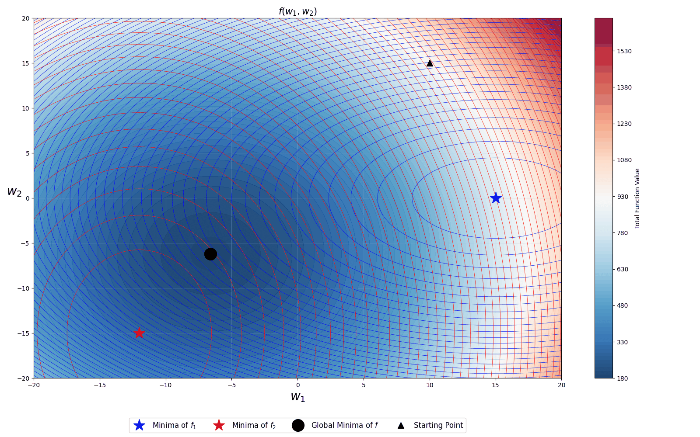

# WS24-SCAFFOLD-Stochastic-Controlled-Averaging-for-Federated-Learning
SCAFFOLD: Stochastic Controlled Averaging for Federated Learning (Unofficial Implementation) 

## Functions Definition

Below are the functions used to calculate the minima:

$$
f_1(W) = 0.5 \cdot (W_0 - 15)^2 + W_1^2, \quad \text{Minima at } (15, 0)
$$

$$
f_2(W) = 2 \cdot (W_0 + 12)^2 + 0.7 \cdot (W_1 + 15)^2, \quad \text{Minima at } (-12, -15)
$$

$$
f(W) = 0.5 \cdot (f_1(W) + f_2(W))
$$

## Results
The green curve shows the Scaffold while Orange curve shows SGD and magenta shows FedAvg. 

## Reference:
SCAFFOLD: Stochastic Controlled Averaging for Federated Learning Sai Praneeth Karimireddy, Satyen Kale, Mehryar Mohri, Sashank J. Reddi, Sebastian U. Stich, Ananda Theertha Suresh
